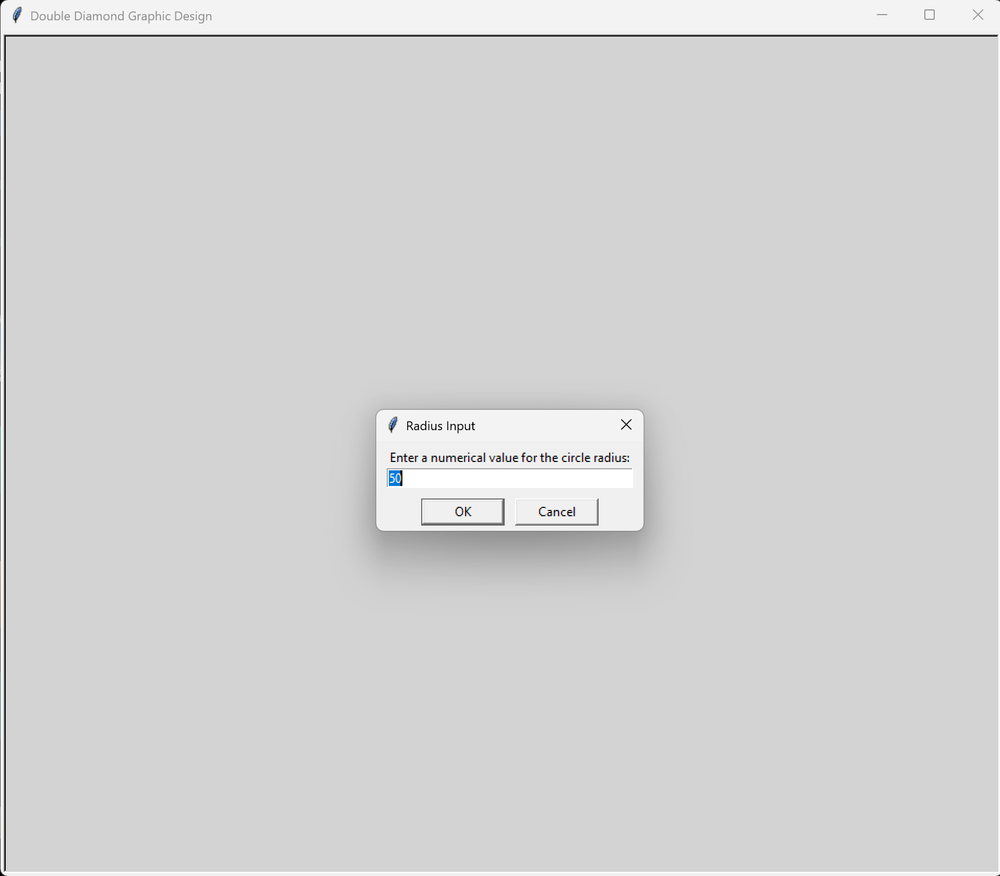
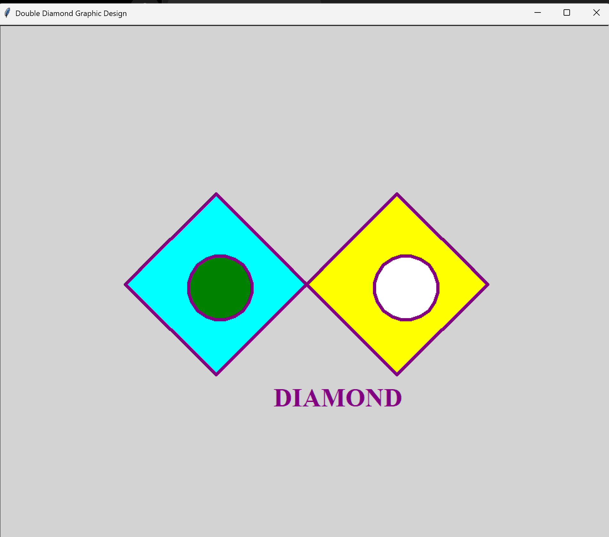

# 💎 Double Diamond Graphic Design

A Python turtle graphics program that draws two overlapping diamond
shapes filled with different colors, adds two circles using a
user-defined radius, and writes a "DIAMOND" caption.

---

## 📋 Features

- Prompts the user to enter a radius value using a popup dialog
- Draws two overlapping diamonds — one cyan and one yellow
- Adds a green and white circle using the user-entered radius
- Writes a "DIAMOND" label on the canvas
- Uses helper functions for clean reusable drawing logic

---

## ⚙️ How It Works

1. User enters a radius value in the popup dialog
2. Two overlapping diamonds are drawn — cyan turning right,
   yellow turning left
3. Two circles are drawn using the radius the user entered
4. A "DIAMOND" label is written at the bottom

---

## 🛠️ Technologies Used

| Technology      | Purpose                                      |
|-----------------|----------------------------------------------|
| Python 3.14     | Core programming language                    |
| `turtle`        | Drawing the graphic design                   |
| `numinput()`    | Popup dialog for user radius input           |
| `begin_fill()`  | Filling shapes with color                    |
| Functions       | Reusable `draw_diamond()` and `draw_circle()` |

---

## 🎓 Learning Outcomes

- Using `begin_fill()` and `end_fill()` to fill shapes
- Using `numinput()` for a graphical popup input dialog
- Using `goto()` to position the turtle at specific coordinates
- Organizing repeated drawing logic into reusable functions
- Drawing circles with `circle()` using a variable radius

---

## 📁 Folder Structure

```
Double-Diamond-Design/
├── Fabrick_Marlena_Double_Diamond_Graphic_Design.py
├── double-diamond-start.png
├── double-diamond-finished.png
├── .gitignore
├── LICENSE
└── README.md
```

---

## 🚀 How to Run

```bash
python Fabrick_Marlena_Double_Diamond_Graphic_Design.py
```

---

## 📸 Screenshots

### Program Start — User Input



### Finished Design



---

## 👩‍💻 Author

**Marlena Fabrick** — Python turtle graphics student project
